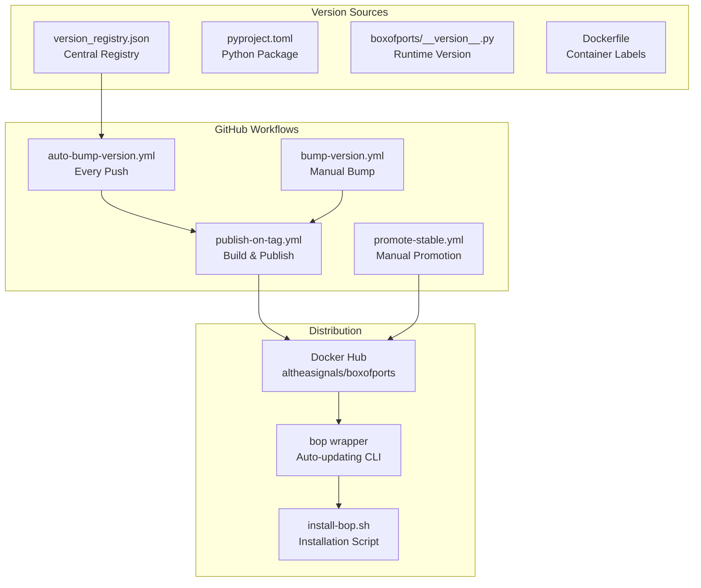
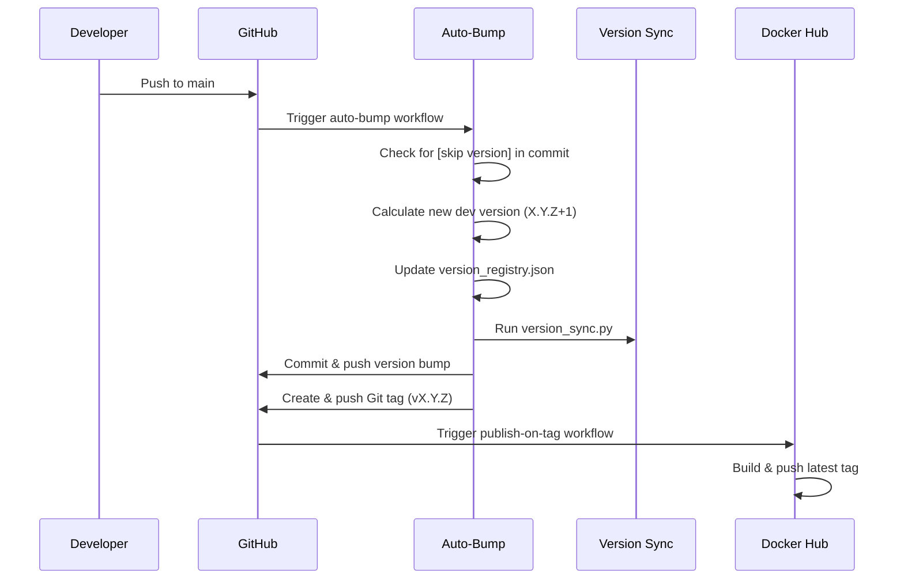
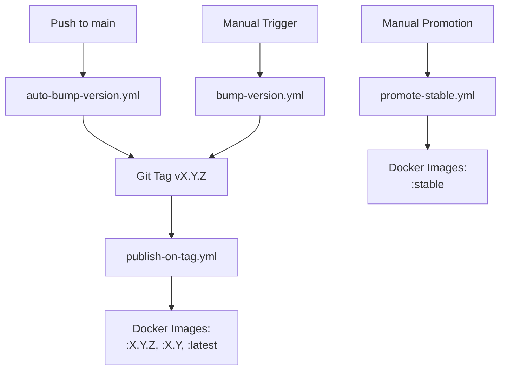
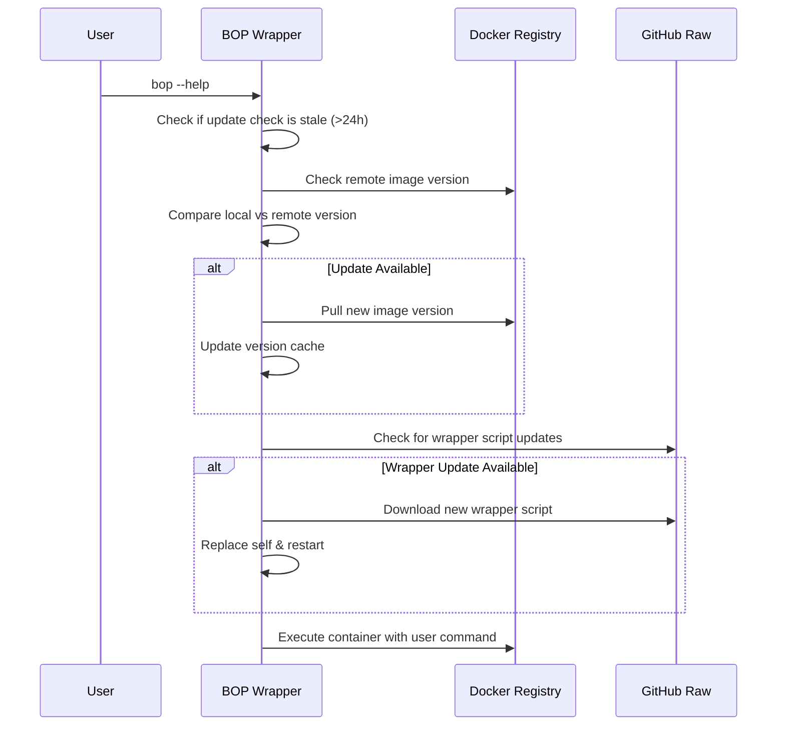
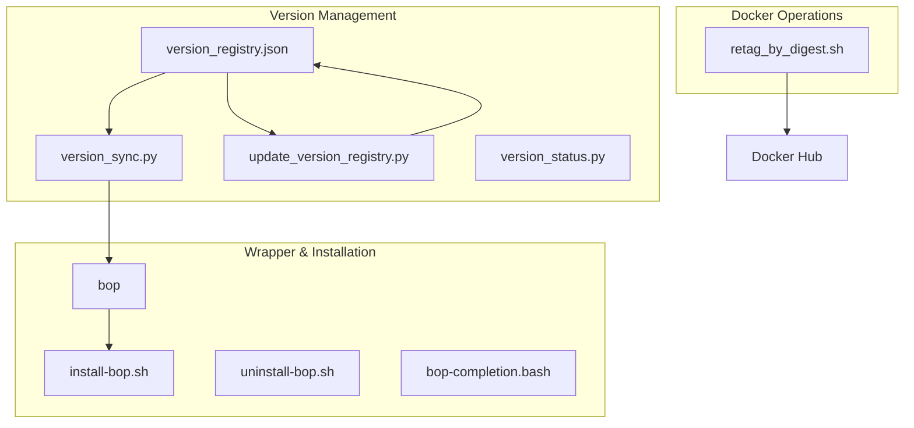
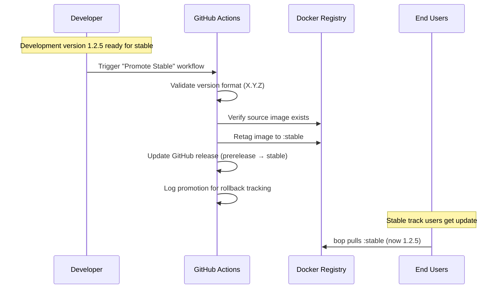
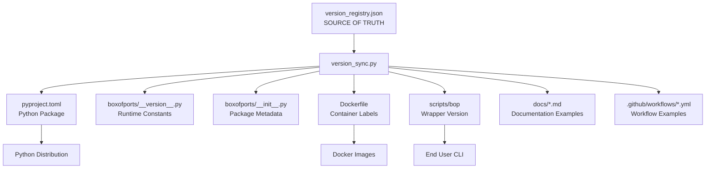
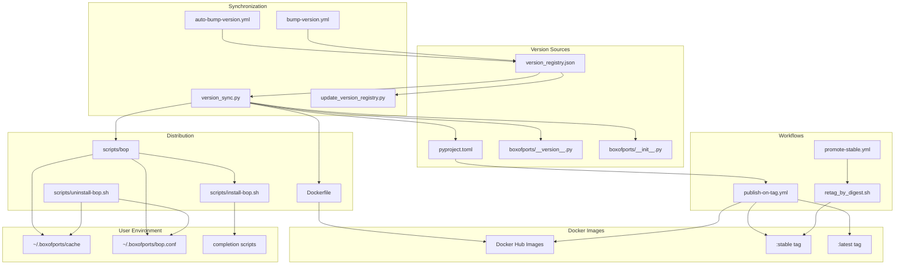
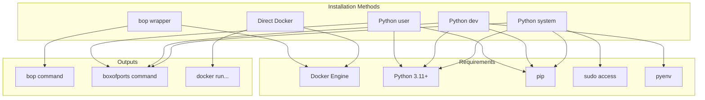
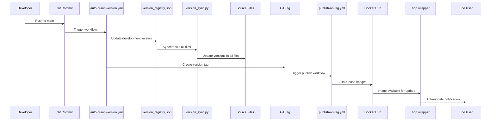

# BoxOfPorts Versioning, Release & Installation Strategy

*"Sometimes the light's all shinin' on me, other times I can barely see"*

This document provides a complete explanation of how BoxOfPorts manages versioning, releases, Docker distribution, and installation across the entire development and deployment lifecycle.

> **⚠️ Important Change**: As of the current system, **ANY** version (X.Y.Z) can be promoted to stable - the version format does NOT determine whether a release is stable or development. All tagged releases start as development and can be manually promoted to stable regardless of their version number.

## Table of Contents

1. [Overview & Architecture](#overview--architecture)
2. [Dual-Track Release System](#dual-track-release-system)
3. [Version Registry - Source of Truth](#version-registry---source-of-truth)
4. [Auto-Bump Strategy](#auto-bump-strategy)
5. [GitHub Workflows & CI Pipeline](#github-workflows--ci-pipeline)
6. [Docker Publication & Tag Management](#docker-publication--tag-management)
7. [BOP Wrapper Version Management](#bop-wrapper-version-management)
8. [Scripts Directory Ecosystem](#scripts-directory-ecosystem)
9. [Promotion Flow: Development to Stable](#promotion-flow-development-to-stable)
10. [Installation Methods](#installation-methods)
11. [Version Consistency & File Relationships](#version-consistency--file-relationships)
12. [Troubleshooting & Maintenance](#troubleshooting--maintenance)

---

## Overview & Architecture

BoxOfPorts uses a sophisticated version management system designed around the principle of **intentional, controlled releases** with automatic development builds and manual stable promotions.

### Key Components



### Core Principles

1. **Single Source of Truth**: `version_registry.json` drives all version decisions
2. **Automated Development**: Every commit to main auto-bumps development version
3. **Manual Stable Promotion**: Stable releases require human decision and validation
4. **Docker-First Distribution**: Primary distribution via Docker with wrapper script
5. **Self-Updating Wrapper**: `bop` script automatically updates itself and tracks versions

---

## Dual-Track Release System

BoxOfPorts operates two parallel release tracks:

### Stable Track
- **Format**: Any `X.Y.Z` version (e.g., `1.2.0`, `1.2.5`, `1.3.7`)
- **Purpose**: Production-ready releases for live deployments
- **Docker Tag**: `:stable` (manually promoted)
- **Promotion**: Manual via "Promote Stable" workflow - **ANY** version can be promoted
- **Users**: Default for `bop` wrapper

### Development Track
- **Format**: Any `X.Y.Z` version (e.g., `1.2.1`, `1.2.2`, `1.2.3`)
- **Purpose**: Latest features and fixes, continuous integration
- **Docker Tag**: `:latest` (automatically updated)
- **Creation**: Automatic on every push to main
- **Users**: Opt-in via `BOP_RELEASE_TRACK=dev`

### Track Assignment Logic

**Important**: Version format does NOT determine track assignment. All versions start as development and can be manually promoted to stable regardless of their numbering.

```python
# From publish-on-tag.yml workflow - ALL releases default to development
def classify_new_release(version: str) -> str:
    """All tagged releases start as development by default"""
    return "development"  # Always development initially

# From promote-stable.yml workflow - ANY version can be promoted  
def can_promote_to_stable(version: str) -> bool:
    """Any X.Y.Z version can be promoted to stable"""
    return re.match(r'^[0-9]+\.[0-9]+\.[0-9]+$', version) is not None
```

---

## Version Registry - Source of Truth

The `version_registry.json` file serves as the authoritative source for all version information across the entire system.

### Schema Structure

```json
{
  "_meta": {
    "description": "Central version registry for BoxOfPorts",
    "updated": "2025-09-28T06:42:02.772808+00:00",
    "managed_by": "version_sync.py script and GitHub workflows"
  },
  "versions": {
    "stable": "1.2.10",
    "development": "1.2.11", 
    "api": "2.2"
  },
  "release_info": {
    "stable": {
      "version": "1.2.10",
      "track": "stable",
      "docker_tag": "stable",
      "git_tag": "v1.2.0",
      "released": "2025-09-28T06:41:34.525328+00:00",
      "notes": "Production-ready stable release"
    },
    "development": {
      "version": "1.2.3",
      "track": "dev", 
      "docker_tag": "latest",
      "git_tag": "v1.2.3",
      "released": "2025-09-27T12:00:00Z",
      "notes": "Development release with latest features"
    }
  },
  "docker": {
    "registry": "docker.io",
    "image_name": "altheasignals/boxofports",
    "tags": {
      "stable": "stable",
      "development": "latest"
    }
  },
  "bop_wrapper": {
    "version": "1.2.11",
    "description": "Docker wrapper with dual-track support and auto-updates"
  }
}
```

### Producers (Who Updates the Registry)

1. **`auto-bump-version.yml` workflow** - Updates development version on every push
2. **`bump-version.yml` workflow** - Manual version bumps (stable or development)  
3. **`scripts/update_version_registry.py`** - Manual registry updates
4. **`scripts/version_sync.py`** - Propagates registry changes to all files

### Consumers (Who Reads the Registry)

1. **`scripts/bop`** - Checks version compatibility and updates
2. **`scripts/version_sync.py`** - Synchronizes all files with registry
3. **GitHub workflows** - Base version decisions on registry state
4. **Docker builds** - Embed version labels from registry
5. **Installation scripts** - Determine latest available versions

---

## Auto-Bump Strategy

Every push to the main branch automatically increments the development version, ensuring continuous progression without manual intervention.

### Auto-Bump Workflow (`auto-bump-version.yml`)

**Triggers**: 
- Push to `main` branch
- Excludes: docs changes, workflow changes

**Process**:



**Version Calculation Logic**:

```python
# From auto-bump-version.yml workflow
def calculate_next_dev_version(current_dev_version: str) -> str:
    """Increment patch version for development track"""
    major, minor, patch = map(int, current_dev_version.split('.'))
    return f"{major}.{minor}.{patch + 1}"

# Example: 1.2.5 → 1.2.6
```

**Safety Measures**:
- Skip if commit message contains `[skip version]`
- Skip if commit is already a version bump
- Fail fast on invalid version formats
- No destructive operations in dry-run mode

---

## GitHub Workflows & CI Pipeline

BoxOfPorts uses a comprehensive set of GitHub Actions workflows to manage the entire release lifecycle.

### Workflow Inventory

| Workflow | Trigger | Purpose | Outputs |
|----------|---------|---------|---------|
| `auto-bump-version.yml` | Push to main | Auto-increment development version | Version tag, updated registry |
| `bump-version.yml` | Manual dispatch | Controlled version bumps | Version tag, PR option |
| `publish-on-tag.yml` | Tag push (`v*.*.*`) | Build & publish Docker images | Docker images, GitHub release |
| `promote-stable.yml` | Manual dispatch | Promote version to stable track | Retagged `:stable` image |
| `docker-publish.yml` | Push to main/tags | Simple Docker build | `:latest` image |
| `promote-any-to-stable.yml` | Manual dispatch | Emergency promotion | Flexible stable promotion |

### Key Workflow Relationships



### Secrets & Configuration

**Required GitHub Secrets**:
- `DOCKERHUB_USERNAME` - Docker Hub authentication
- `DOCKERHUB_TOKEN` - Docker Hub access token  
- `GITHUB_TOKEN` - Automatic (for releases and tagging)

**Environment Variables**:
- `REGISTRY=docker.io` - Target Docker registry
- `IMAGE_NAME=altheasignals/boxofports` - Full image name

---

## Docker Publication & Tag Management

BoxOfPorts uses a sophisticated Docker tagging strategy to support both development and stable channels.

### Docker Tags & Their Meanings

| Tag | Purpose | Updated By | Points To |
|-----|---------|------------|-----------|
| `:stable` | Production deployments | Manual promotion only | Latest promoted X.Y.0 version |
| `:latest` | Development/testing | Auto-updated on dev releases | Latest X.Y.Z where Z>0 |
| `:X.Y.Z` | Specific version pin | Build workflow | Exact version build |
| `:X.Y` | Major.minor series | Build workflow | Latest in X.Y.* series |

### Build Process

**Multi-Architecture Support**:
- Linux AMD64 (standard servers)
- Linux ARM64 (Apple Silicon, modern ARM servers)

**Build Features**:
- Docker Buildx for multi-platform builds
- Build cache optimization via GitHub Actions cache
- Version labels embedded in image metadata
- Health check for container validation

**Version Labels in Images**:

```dockerfile
# From Dockerfile - dynamically set during build
LABEL org.opencontainers.image.version="${VERSION}"
LABEL io.boxofports.version="${VERSION}"
LABEL io.boxofports.track="${TRACK}"
LABEL io.boxofports.stable="${IS_STABLE}"
```

### Tag Promotion Logic

**All New Releases (Any X.Y.Z version)**:
```bash
# All releases automatically update :latest tag
./scripts/retag_by_digest.sh \
  "altheasignals/boxofports:1.2.3" \
  "altheasignals/boxofports:latest"
```

**Manual Stable Promotion (Any X.Y.Z version)**:
```bash
# ANY version can be promoted to stable - version format doesn't matter
./scripts/retag_by_digest.sh \
  "altheasignals/boxofports:1.2.7" \
  "altheasignals/boxofports:stable"

# Even traditionally "development" versions can become stable
./scripts/retag_by_digest.sh \
  "altheasignals/boxofports:1.3.5" \
  "altheasignals/boxofports:stable"
```

---

## BOP Wrapper Version Management

The `bop` script is a sophisticated Docker wrapper that provides automatic version checking, track management, and self-updates.

### Version Detection Logic

```bash
# From scripts/bop
get_local_version() {
    local tag="$1"
    docker inspect "${DOCKER_IMAGE}:${tag}" \
        --format='{{index .Config.Labels "version"}}' 2>/dev/null || echo "unknown"
}

get_remote_version() {
    local tag="$1"
    docker manifest inspect "${DOCKER_IMAGE}:${tag}" \
        --format='{{index .Config.Labels "version"}}' 2>/dev/null || echo "unknown"
}
```

### Release Track Configuration

**Default (Stable Track)**:
```bash
bop --help  # Uses :stable Docker tag
```

**Development Track Options**:
```bash
# Environment variable
BOP_RELEASE_TRACK=dev bop --help

# Config file (~/.boxofports/bop.conf)
release_track=dev

# Cosmic mode (development + enhanced UI)
bop --bop steal-your-face  # Creates ~/.boxofports/.steal_your_face
```

### Auto-Update Process



### Version Cache Management

**Cache Files**:
- `~/.boxofports/.bop_version_cache` - Stores version and timestamp
- `~/.boxofports/.bop_update_check` - Tracks wrapper update checks  
- `~/.boxofports/.bop_force_update` - Forces immediate update

**Cache Logic**:
- Version checks cached for 1 hour
- Wrapper update checks cached for 24 hours
- Force updates bypass cache entirely

---

## Scripts Directory Ecosystem

The `scripts/` directory contains a coordinated set of utilities that manage versioning, synchronization, and deployment.

### Script Inventory & Relationships



### Key Scripts Explained

#### `version_sync.py` - The Synchronizer
**Purpose**: Propagates version changes from registry to all files
**Usage**: 
```bash
python3 scripts/version_sync.py --stable      # Sync stable version
python3 scripts/version_sync.py --development # Sync dev version  
```

**Files Updated**:
- `pyproject.toml` - Python package version
- `boxofports/__version__.py` - Runtime version constants
- `boxofports/__init__.py` - Package initialization
- `Dockerfile` - Container version labels
- `scripts/bop` - Wrapper version header
- Documentation examples

#### `update_version_registry.py` - Manual Updates
**Purpose**: Manual version registry updates with GitHub integration
**Usage**:
```bash
# Promote version to stable
python3 scripts/update_version_registry.py --stable 1.3.0

# Update development version  
python3 scripts/update_version_registry.py --dev 1.2.5

# Sync only (no version change)
python3 scripts/update_version_registry.py --sync-only
```

**Features**:
- Automatic GitHub release promotion
- Git commit and push integration
- Version validation and safety checks

#### `bop` - The User Interface
**Purpose**: Self-updating Docker wrapper for BoxOfPorts
**Key Features**:
- Dual-track version management
- Automatic image pulling and updates
- Self-updating wrapper script
- Volume mounting for user data
- Shell completion support

#### `install-bop.sh` - Bootstrap Installation
**Purpose**: One-line installation of bop wrapper
**Usage**:
```bash
# User installation
curl -fsSL https://raw.githubusercontent.com/altheasignals/BoxOfPorts/main/scripts/install-bop.sh | bash

# System installation  
curl -fsSL https://raw.githubusercontent.com/altheasignals/BoxOfPorts/main/scripts/install-bop.sh | sudo bash -s -- --system
```

### Script Interaction Matrix

| Script | Reads From | Writes To | Called By |
|--------|------------|-----------|-----------|
| `version_sync.py` | `version_registry.json` | All source files | Workflows, manual |
| `update_version_registry.py` | User input | `version_registry.json` | Manual only |
| `bop` | Docker labels, GitHub | Cache files | End users |
| `install-bop.sh` | GitHub raw | User filesystem | Installation |

---

## Promotion Flow: Development to Stable

The promotion from development to stable is a carefully orchestrated process that ensures quality and allows for proper validation.

### Promotion Workflow Steps



### Manual Promotion Process

**Via GitHub UI**:
1. Navigate to Actions → "Promote Stable"
2. Select target version (or auto-select latest)
3. Optional dry-run to preview changes
4. Execute promotion

**Validation Checks**:
- Source image must exist in Docker registry
- Version format validation (semantic versioning)
- Graceful handling of missing stable tag
- Rollback information logged

### Flexible Promotion

**Note**: The standard `promote-stable.yml` workflow already allows promoting any version to stable. The description showing "1.2.5" as an example in the workflow demonstrates this - any X.Y.Z version can be promoted, not just X.Y.0 versions.

For additional flexibility, there's also a `promote-any-to-stable.yml` workflow:

```yaml
# Explicit workflow for promoting any version to stable
inputs:
  target_version:
    description: 'Any version to promote (e.g., 1.2.7)'
    required: true
```

### Rollback Procedure

If a stable release has issues:

```bash
# Rollback using digest-based retagging  
./scripts/retag_by_digest.sh \
  "altheasignals/boxofports:1.2.4" \
  "altheasignals/boxofports:stable"
```

**Rollback Information**:
- Promotion log stored in `~/.boxofports/stable-promotions.log`  
- Contains timestamp, version, and promotion method
- Used for tracking and emergency rollback decisions

---

## Installation Methods

BoxOfPorts supports multiple installation methods to accommodate different user preferences and deployment scenarios.

### Primary Method: BOP Wrapper (Recommended)

**One-line Installation**:
```bash
# User installation (no sudo required)
curl -fsSL https://raw.githubusercontent.com/altheasignals/BoxOfPorts/main/scripts/install-bop.sh | bash

# System-wide installation
curl -fsSL https://raw.githubusercontent.com/altheasignals/BoxOfPorts/main/scripts/install-bop.sh | sudo bash -s -- --system
```

**Features**:
- Automatic Docker image management
- Self-updating wrapper script
- Dual-track support (stable/development)
- Shell completion integration
- Volume mounting for user data

### Direct Docker Usage

**Stable Channel**:
```bash
# Latest stable release
docker run --rm -it \
  -v ~/.boxofports:/app/config \
  -v $(pwd):/workspace \
  --workdir /workspace \
  altheasignals/boxofports:stable --help
```

**Development Channel**:
```bash
# Latest development build  
docker run --rm -it \
  -v ~/.boxofports:/app/config \
  -v $(pwd):/workspace \
  --workdir /workspace \
  altheasignals/boxofports:latest --help
```

### Python Package Installation

**From PyPI** (when available):
```bash
pip install boxofports
```

**From Source**:
```bash
git clone https://github.com/altheasignals/boxofports.git
cd boxofports
pip install -e .
```

### Version Selection Examples

**Pinning Specific Versions**:
```bash
# Pin to exact version
docker run --rm -it altheasignals/boxofports:1.2.5 --help

# Pin to major.minor series  
docker run --rm -it altheasignals/boxofports:1.2 --help
```

**BOP Wrapper Track Selection**:
```bash
# Default stable track
bop --help

# Development track via environment
BOP_RELEASE_TRACK=dev bop --help

# Development track via config file
echo "release_track=dev" > ~/.boxofports/bop.conf
bop --help

# Cosmic mode (development + enhanced UI)
bop --bop steal-your-face
bop --help  # Now uses development track with special features
```

---

## Version Consistency & File Relationships

BoxOfPorts maintains strict version consistency across multiple files and systems through automated synchronization.

### File Synchronization Map



### Version Sources & Targets

| File | Role | Version Source | Updated By |
|------|------|----------------|------------|
| `version_registry.json` | **Source of Truth** | Manual/Workflows | `auto-bump-version.yml`, `bump-version.yml` |
| `pyproject.toml` | Python package | Registry → sync | `version_sync.py` |
| `boxofports/__version__.py` | Runtime constants | Registry → sync | `version_sync.py` |
| `boxofports/__init__.py` | Package metadata | Registry → sync | `version_sync.py` |
| `Dockerfile` | Container labels | Registry → sync | `version_sync.py` |
| `scripts/bop` | Wrapper header | Registry → sync | `version_sync.py` |

### Synchronization Rules

**Stable Track Sync** (`--stable` flag):
- Uses `versions.stable` from registry
- Updates all files to stable version
- Used for stable release preparation

**Development Track Sync** (`--development` flag):  
- Uses `versions.development` from registry
- Updates all files to development version
- Used for continuous development

**Example Version States**:

```json
// version_registry.json state
{
  "versions": {
    "stable": "1.2.0",
    "development": "1.2.3"
  }
}
```

After `python3 scripts/version_sync.py --stable`:
- `pyproject.toml`: `version = "1.2.0"`
- `Dockerfile`: `LABEL version="1.2.0"`
- `scripts/bop`: `# bop (Docker wrapper) v1.2.0`

After `python3 scripts/version_sync.py --development`:
- `pyproject.toml`: `version = "1.2.3"`
- `Dockerfile`: `LABEL version="1.2.3"`  
- `scripts/bop`: `# bop (Docker wrapper) v1.2.3`

### Validation & Consistency Checks

**Automated Validation** (proposed):
```python
# scripts/verify_version_consistency.py (future addition)
def verify_version_consistency():
    """Ensure all files match version_registry.json"""
    registry = load_version_registry()
    
    # Check pyproject.toml matches
    pyproject_version = extract_pyproject_version()
    assert pyproject_version == registry['versions']['stable']
    
    # Check Dockerfile labels  
    dockerfile_version = extract_dockerfile_version()
    assert dockerfile_version == registry['versions']['stable']
    
    # Add more validations...
```

---

## Troubleshooting & Maintenance

### Common Issues & Solutions

```bash
# Update bop wrapper to latest version
bop --bop update-wrapper

# Or reinstall completely
curl -fsSL https://raw.githubusercontent.com/altheasignals/BoxOfPorts/main/scripts/install-bop.sh | bash
```

#### "Source image not found" during promotion  
**Problem**: Trying to promote a version that wasn't built
**Cause**: Git tag was not created or publish workflow failed
**Solution**:
```bash
# Check if tag exists
git tag -l | grep v1.2.5

# Check if Docker image exists  
docker manifest inspect altheasignals/boxofports:1.2.5

# Manually create tag if missing
git tag -a v1.2.5 -m "Release 1.2.5"
git push origin v1.2.5
```

#### Version Synchronization Issues
**Problem**: Files have inconsistent versions
**Cause**: Manual edits bypassed version_sync.py
**Solution**:
```bash  
# Re-sync all files from registry
python3 scripts/version_sync.py --stable

# Or force sync development track
python3 scripts/version_sync.py --development
```


### Maintenance Procedures

#### Version Registry Health Check
```bash
# Validate registry structure
python3 -c "
import json
with open('version_registry.json') as f:
    registry = json.load(f)
    
# Check required fields
assert 'versions' in registry
assert 'stable' in registry['versions']  
assert 'development' in registry['versions']
print('✅ Registry structure valid')
"
```

#### Docker Tag Audit
```bash
# List all tags for boxofports image
docker search altheasignals/boxofports --format "table {{.Name}}\t{{.Description}}"

# Inspect specific tag metadata
docker manifest inspect altheasignals/boxofports:stable --verbose
```

#### Workflow Health Monitoring
- Monitor GitHub Actions for failed workflows
- Check Docker Hub for successful image pushes
- Validate that auto-bump versions are incrementing correctly
- Ensure stable promotions update the `:stable` tag

### Emergency Procedures  

#### Emergency Stable Rollback
```bash
# Immediate rollback to previous stable version
./scripts/retag_by_digest.sh \
  "altheasignals/boxofports:1.2.4" \
  "altheasignals/boxofports:stable"
```

#### Version Registry Recovery
```bash
# Restore from Git history if registry is corrupted
git checkout HEAD~1 -- version_registry.json
git add version_registry.json
git commit -m "fix: restore version registry from backup"
git push
```

#### Disable Auto-Bump Temporarily
```bash
# Add [skip version] to commit messages
git commit -m "hotfix: critical security update [skip version]"
```

---

## Artifact Inventory

This section provides a complete inventory of all versioning, distribution, and installation artifacts in the BoxOfPorts codebase.

### Version Management Files

| File | Purpose | Managed By | Content |
|------|---------|------------|---------|
| `version_registry.json` | Central version source of truth | Workflows + scripts | Version numbers, release info, Docker tags |
| `boxofports/__version__.py` | Runtime version constants | `version_sync.py` | Version info, metadata, display functions |
| `boxofports/__init__.py` | Package metadata | `version_sync.py` | Package version, author, license |
| `pyproject.toml` | Python package configuration | `version_sync.py` | Package version, dependencies, build config |

### Docker & Container Files

| File | Purpose | Content |
|------|---------|----------|
| `Dockerfile` | Container image definition | Multi-arch build, version labels, user setup |
| `docker-entrypoint.sh` | Container startup script | Environment setup, command execution |
| `docker-compose.yml` | Local development orchestration | Service definitions, volume mounts |
| `docker/bop` | Alternative Docker wrapper | Legacy wrapper for Docker environments |

### GitHub Workflows

| Workflow | Trigger | Purpose | Outputs |
|----------|---------|---------|----------|
| `auto-bump-version.yml` | Push to main | Auto-increment development version | Version tag, registry update |
| `bump-version.yml` | Manual dispatch | Controlled version bumps | Version tag, optional PR |
| `publish-on-tag.yml` | Tag push (`v*.*.*`) | Build & publish Docker images | Multi-arch images, GitHub release |
| `promote-stable.yml` | Manual dispatch | Promote any version to stable | Retagged `:stable` image |
| `promote-any-to-stable.yml` | Manual dispatch | Emergency/flexible promotion | Stable promotion |
| `docker-publish.yml` | Push to main/tags | Simple Docker build | `:latest` image |
| `release.yml` | Manual dispatch | Release creation | GitHub release |
| `version-lint.yml` | PR/push | Version consistency validation | CI validation |
| `debug-test.yml` | Manual dispatch | Debugging workflow issues | Debug output |

### Distribution Scripts

#### Main Wrapper Scripts
| Script | Purpose | Installation Method | Features |
|--------|---------|--------------------|---------|
| `scripts/bop` | Primary Docker wrapper | One-line install | Auto-update, dual-track, self-healing |
| `scripts/bop-legacy` | Legacy wrapper | Manual | Backward compatibility |
| `boxofports-dev` | Development wrapper | Local dev | Direct Python execution |

#### Installation Scripts
| Script | Target | Installation Type | Requirements |
|--------|--------|-------------------|-------------|
| `scripts/install-bop.sh` | End users | Docker wrapper | Docker, curl |
| `scripts/uninstall-bop.sh` | End users | Cleanup | Detection of all install types |
| `install-user.sh` | Individual users | Python package | Python 3.11+, pip |
| `install-dev.sh` | Developers | Editable installation | pyenv, Python 3.11+ |
| `install-system.sh` | System admins | System-wide | sudo, Python 3.11+ |
| `install.sh` | Generic | Multi-mode installer | Auto-detection |
| `install.ps1` | Windows | PowerShell installer | Windows/WSL |

#### Utility Scripts
| Script | Purpose | Usage |
|--------|---------|-------|
| `scripts/version_sync.py` | Synchronize versions across files | Workflows, manual |
| `scripts/update_version_registry.py` | Manual registry updates | Maintenance, promotion |
| `scripts/version_status.py` | Version status checking | Debugging |
| `scripts/retag_by_digest.sh` | Docker tag management | Promotion workflows |
| `scripts/test-completion.sh` | Test completion scripts | Development |

### Shell Completion

| File | Target Command | Installation |
|------|----------------|-------------|
| `scripts/bop-completion.bash` | `bop` wrapper | Auto-installed with `bop` |
| `scripts/boxofports-completion.bash` | `boxofports` command | Manual or via `--install-completion` |

Both completion scripts provide:
- Command and subcommand completion
- Option completion with context awareness
- Port pattern examples (`1A`, `1A-1D`, `1A,2B,3C`)
- Message type completion (`regular`, `stop`, `system`)

### Configuration & Data Files

| File | Purpose | Location | Format |
|------|---------|----------|--------|
| `~/.boxofports/bop.conf` | BOP wrapper config | User home | Key=value pairs |
| `~/.boxofports/.bop_version_cache` | Version cache | User home | Version + timestamp |
| `~/.boxofports/.bop_update_check` | Update check cache | User home | Timestamp |
| `~/.boxofports/.steal_your_face` | Cosmic mode flag | User home | Existence flag |
| `~/.boxofports/stable-promotions.log` | Promotion log | User home | CSV format |

### Documentation Files

#### Core Documentation
| File | Purpose | Audience |
|------|---------|----------|
| `README.md` | Project overview | All users |
| `CHANGELOG.md` | Version history | All users |
| `LICENSE` | License terms | Legal |
| `WARP.md` | AI assistant rules | Development |

#### Detailed Guides
| File | Purpose | Audience |
|------|---------|----------|
| `docs/VERSIONING.md` | Legacy versioning guide | Developers |
| `docs/DISTRIBUTION.md` | Legacy distribution guide | Developers |
| `docs/COMPREHENSIVE-VERSIONING-AND-DISTRIBUTION.md` | This document | All stakeholders |
| `docs/ROLLBACK.md` | Emergency procedures | Operations |
| `docs/COMPLETION.md` | Shell completion guide | End users |
| `docs/WHY_BOXOFPORTS.md` | Project rationale | Stakeholders |

#### Usage Documentation
| File | Purpose | Audience |
|------|---------|----------|
| `docs/usage/USAGE_GUIDE.md` | Complete usage guide | End users |
| `docs/usage/GUI_OPERATORS_GUIDE.md` | GUI operation guide | Operators |
| `docs/usage/INBOX_DOCUMENTATION.md` | Inbox management | Operators |

#### Technical Documentation
| File | Purpose | Audience |
|------|---------|----------|
| `docs/dev/IMPLEMENTATION_SUMMARY.md` | Technical overview | Developers |
| `docs/dev/CLI_INVOCATION_STRATEGY.md` | CLI architecture | Developers |
| `docs/dev/CONSISTENCY_CHANGES.md` | Change tracking | Developers |
| `docs/deployment/DEPLOYMENT.md` | Deployment guide | DevOps |

### Build & Development Files

| File | Purpose | Usage |
|------|---------|-------|
| `Makefile` | Build automation | Development workflow |
| `.gitignore` | Git exclusions | Version control |
| `.env` / `.env.example` | Environment variables | Configuration |
| `pyproject.toml` | Python build config | Package building |

### Testing Files

| Directory/File | Purpose | Framework |
|----------------|---------|----------|
| `tests/` | Test suite directory | pytest |
| `tests/conftest.py` | Test configuration | pytest |
| `test_table_export.py` | Table export tests | pytest |
| `splash.py` | CLI splash screen | Direct execution |

### Source Code Structure

| Directory/File | Purpose | Key Components |
|----------------|---------|----------------|
| `boxofports/` | Main package | CLI, API, utilities |
| `boxofports/cli.py` | Command line interface | Typer-based CLI |
| `boxofports/api_models.py` | API data models | Pydantic models |
| `boxofports/config.py` | Configuration management | Profile handling |
| `boxofports/table_export.py` | Table export functionality | CSV/JSON export |
| `boxofports/__main__.py` | Module execution entry | Direct execution |

### Artifact Relationships & Dependencies

This diagram shows how the key artifacts interact with each other:



### Installation Method Dependencies



### Versioning Artifact Flow



## Critical Files by Category

**Version Management**:
- `version_registry.json` - Central version source of truth
- `pyproject.toml` - Python package version
- `boxofports/__version__.py` - Runtime version constants

**Docker & Distribution**:  
- `Dockerfile` - Container definition with version labels
- `docker-entrypoint.sh` - Container startup script
- `scripts/bop` - Primary user interface wrapper

**Scripts & Automation**:
- `scripts/version_sync.py` - Version synchronization engine
- `scripts/update_version_registry.py` - Manual registry updates
- `scripts/install-bop.sh` - User installation bootstrap  
- `scripts/retag_by_digest.sh` - Docker tag management

**GitHub Workflows**:
- `.github/workflows/auto-bump-version.yml` - Automatic development versioning
- `.github/workflows/bump-version.yml` - Manual version control
- `.github/workflows/publish-on-tag.yml` - Build & publish pipeline
- `.github/workflows/promote-stable.yml` - Stable promotion workflow

**Documentation**:
- `docs/VERSIONING.md` - Legacy version management guide
- `docs/DISTRIBUTION.md` - Legacy distribution guide
- `README.md` - Primary project documentation

---

*This document represents the complete versioning, release, and installation strategy for BoxOfPorts as of September 2025. The system embodies the principle that "the music never stopped playing" - providing continuous development flow while maintaining stable, reliable releases for production use.*

*Built with ❤️ by Althea Signals Network LLC*